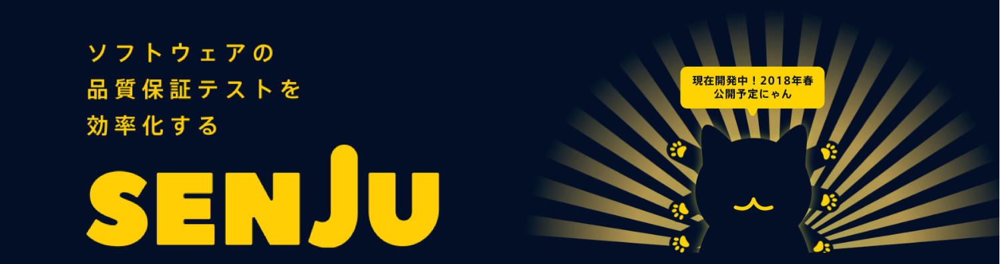

# Jirettai-Senju-Project-事業計画書

平成29年 4月 5日 
代表者 溝垣 雅人 
所属名 株式会社じれったい 

-記-

### 事業化構想の名称 「ソフトウェア品質テスト自動化ツール SENJU」

 

### 代表者及び共同製作者

|  氏名 | 所属 |
| --- | --- |
| 溝垣 雅人 | 合同会社じれったい  CEO & Programmer |
| 大堀 祐一 | 合同会社じれったい  Product Designer & 株式会社DenDesign CEO|
| 柴田 幸輝 | 合同会社じれったい Chief Technology Officer |  
| 神谷 小太郎| 合同会社じれったい Chierf Information Officer |  
| 小林 宏知 |  合同会社じれったい Software Development Kit Programmer | 
 

### 品質保証テストとは

・開発スケジュールの多くを占め、バグの少ない高品質な開発には不可欠
・大手企業ではエンジニアの1/3をテスト要員として割く
・QAテスト専門の会社も存在

### マーケットサイズ

ソフトウェア開発市場規模（13兆円？）
　→QAテストの市場規模を算出（人員ベースでは約4人に1人がテスト要員）
　→この市場を切り開く！

### 隠れたマーケット

・クラウドソーシングのような小規模開発の現場
・スピード重視で進むスタートアップ
　→テストをしたくてもできていいなかった市場も存在

クラウドソーシングの市場規模 
（大した数字でなければページ自体削除でも可） 

### QAテストの流れ

①ソフトウェア開発 
↓↑ 
②単体テスト 
↓ 
③テスト設計 
↓ 
④結合テスト 
↓ 
⑤バグ報告 
↓ 
⑥タスク化　→① 

＝＝＝

### SENJUの提供する解決策

QAテストの流れの中の 
③、④をほぼ自動化し、バグ（仕様との差）報告をスムーズにする

### HOW

特許出願中の差分抽出機能
新旧バージョンの画面をサーバー上に保存し、その差分を自動で抽出。
確認をToDOリスト化することで高速でのバグ報告が可能
例：　5人日→1人日　80％削減！

### デモ
あると最高

### 料金
導入無料 
同プロジェクトにユーザー2名以上登録する際に課金。 
5000円/人月のサブスクリプション 

例：5名で1年間継続利用した場合 
（5-1）×5000×12=240,000円 

### 今後のスケジュール

初年度 
α版リリース　無料開放でブラッシュアップ 
β版リリース　有料版スタート 
有料ユーザー獲得目標　100人（登録者数は500人見込み）　  

2年目 
多機能化、高速化を進める 
英語版リリース 
有料ユーザー獲得目標　1000人（登録者数は5000人見込み）　  
法人向けに営業加速 

3年目 
バグの自動抽出機能リリース 
有料ユーザー獲得目標　10000人（登録者数は50000人見込み）　  
課金者10000人獲得の際の年間売上：6億円 

4年目 
有料ユーザー獲得目標　50000人（登録者数は250000人見込み）　 
課金者30000人獲得の際の年間売上：30億円 

5年目 
有料ユーザー獲得目標　100,000人（登録者数は500,000人見込み）　 
課金者100,000人獲得の際の年間売上：60億円 

# 事業計画書（要約版）

2017年

| 事業構想の名称 | 「開発環境支援システム」の事業化 |
| --- | --- |
| １．事業構想概要 |
# 事業の動機，開発背景
QAエンジニアをなくしたいと考えている．それはソフトウェア開発においてQA業務が多くの開発機関と経営資源を奪うからである．QAが自動化されれば開発期間が短くなり，ユーザへのソフトウェアの提供が飛躍的に短くなる．また，開発エンジニアもソフトウェアの開発に専念でき，結果的にソフトウェア開発の品質向上に繋がると考えている．

Figure 1 QAについて私達はその課題を開発環境支援ソフトウェアで解決した．以下開発ソフトウェアの内容．
# その解決策は，競合と比較して，どのような競争優位性があるのか？
　現在QAはQAエンジニアが行っており，多くの時間とコストを費やしている．開発期間およびコストに関して，QAエンジニアのケースおよび，このシステムのケースとを比較すると以下の図のようになる．

Figure 2　コスト比較
# どの市場を狙っているのか，その市場の成長性？
国内のソフトウェア市場は，Figure 3のように，今後も3%程度の成長が予想されている．QAエンジニア5万人

Figure 3　ソフトウェア市場の成長予想

事業の当初はQAの市場をターゲットとし，これは，全てのソフトウェア関連企業にとって必須であり十分な規模を有している．定量的にそのソフトウェア市場のデータをこのシステムで収集し，コンサルティングまで行うことができるスケーラビリティのあるサービスになっている．
# どうやって，顧客に商品／サービスを提供するのか？
大手ソフトウェア会社への導入により実績を積み重ね，QA市場を席巻する． |
| ２．活動体制 |
# どのようなチームで，上述の事業構想を達成しようとしているのか？
　このチームは高い志と情熱を持ち，ソフトウェアの労働環境及び品質を改善するために現在も邁進している．今後もソフトウェアによって多様な品質改善のビジネスを提案していく． |

事業計画書（本文）

# １．概要

・代表者        溝垣

・共同提案者

・プロフィール

高い志と情熱を持ち，ソフトウェアの労働環境及び品質を改善するために現在も邁進している．今後もソフトウェアによって多様な品質改善のビジネスを提案していく．

# ２．現状の課題等

ITエンジニアは慢性的な人材不足であり，経産省の調べによると2015年は約17万人．2030年は約59万人の人材不足になると言われている．その要因は自明で，人材供給が間に合わない，IT業界の急速な発展と拡大，人材の高齢化である．特に世界のIT市場の成長は著しく5兆ドルを超える．

そこで我々が注目したのがQAであり，QAエンジニアをなくしたいと考えている．経産省のソフトウェア産業実態調査統計ではソフトウェア開発において，設計品質の向上，コスト削減，開発機関の短縮が現場で求められていることが分かっている．特にQAエンジニアはチームの大半を占めており，QA業務が多くの開発機関と経営資源を奪っているのが実態である．
これから，QAが自動化されれば開発期間が短くなり，ユーザへのソフトウェアの提供が飛躍的に短くなる．また，開発エンジニアもソフトウェアの開発に専念でき，結果的にソフトウェア開発の品質向上に繋がると考えている．

Figure 1

なぜ，いろんなマーケットセグメントがあるのにQAなのか．

私達はその課題を開発環境支援ソフトウェアで解決した．以下開発ソフトウェアの内容．

# ３．事業の概要

ターゲットはソフトウェア制作関連企業全てであり，特にQAに多くの人材を割いている，大手ソフトウェア会社をメインターゲットとする．事業戦略のターゲットの目標としては、ハイブリッド・ソリューション型を目指す．それは，製品とサービスの両方をバランスよく販売し，メンテナンスそのものをアップグレードしたり，特別な機能拡張を含むサービスを提供することにより，概して利益率が高いケースが多いためである．ハイブリッド・ソリューション型にするのは，ソフトウェア技術が複雑でカスタマイズ性が高いソリューション販売の傾向が高くなる結果，ユーザーが長期間にわたって特定メーカーから離れられなくなるロックイン効果が生じるためである．この事業モデルの最大のメリットは，同じソフトウェアを大量にコピーして販売することによる規模の経済性が生かせることである．
従って，利益成長を望む際はこの規模の経済性が成長に大きく寄与する製品販売に注力し，コモディティ化や不況時などの販売不振時は，安定収益源となるコンサルティングなどのサービス事業に注力していく．

ハイブリッド企業を目指すが，チャネル・パートナーとの利害対立を避けるためにも，インテグレーションとカスタマイゼーションサービスをサードパーティに委託することは重要と考える．それは，ハイブリッド・ソリューション型の成功例は，インテグレーションとカスタマイゼーションサービスをサードパーティ・コンサルタントやソリューション・プロバイダーなど他社に依存しているためである．

このビジネスモデルは多くのニッチ・マーケットと少数のＯＳやデータベース製品、市販アプリケーション・パッケージ等が存在する．そのため，この事業モデルでは，ニッチ・マーケットでの製品・サービス提供やオープンソースなどの出口戦略を目指す．しかし，法人向けであっても個人向けであってもできるだけ大きな市場を狙うのが合理的であり，異なるタイプのユーザー層に効果的に販売するためには多様な戦略と組織力を今後構築していく必要がある．

次に，この事業の料金体系についてだが，段階式定額制を採用し，個人もしくは法人で異なる料金体制を取る．

具体的には，基本プランは個人が年間20,000円，法人向けの場合，2ユーザ100,000円から始まりユーザー数が増えるに従いリーズナブルになるシンプルな料金体制である．
一方，競争優位性の維持のため，高度な機能をオプションとして提供するなど従量的な松竹梅の価格体系を取る．基本的には竹のプランを選択する顧客が多数となると考えられる．また，様々な顧客ニーズに対応するために，サポートサービスを月額1,000円程度で提供する．試用0円，アマチュア向け20,000，玄人40,000．

法人向けソフトウェア企業がメインストリーム市場に到達するためには、ジェフリー・ムーアが言うホールプロダクト・ソリューションを提供する必要がある．即ち，信頼性の面でも強固で，保守派のレイト・アダプターにとっても使い易く、分かり易い説明書や完全なテクニカル・サポートの提供などが十分備わっている必要がある．
法人向けは，販売後の保守・メンテナンスサービスやカスタマイズ要求などによりコストがかさみ利益が大幅に減少する可能性がある一方で，販売する顧客の業界仕様にカスタマイズすることで，使いまわし販売できるメリットもある．こうした両者のデメリット・メリットを充分斟酌していく．
一方，収益的に個人向けの場合，ヒットすれば莫大な利益が入るが，続篇やアップグレード製品を売るのは前よりも難しくなるといったリスクがある．また人気製品を持つ企業でもカスタマーサポートサービスのサポート費用の増加で赤字にあるリスクもある．

すべてのQAエンジニアをターゲットとする水平型市場を狙う場合，莫大な投資とスキルの獲得が必要になるため，経営資源が不足している事業開始時点では水平市場で戦わない．
また競争力が高いソフトと競争力が低いソフトを抱き合わせ販売した場合，往々にして競争力の低いソフトを改良しないまま放置しておくケースが多く，その場合，あとで修正モジュールの提供などの費用増に繋がることが多いため，安易な抱合せ販売は行わない．このソフトウェアビジネスは，サービスとメンテナンスが継続的な売上を生み出す構造であり，製品販売においてもアップグレードで上位のみ互換性を持たせるなどの仕組みを入れることで予想可能な売上を作ることができると考えている．

このサービスの目的は，このサービスを提供することによって得られる顧客データの活用である．今回提供するソフトウェアはユーザの入力データのみならず画像や音声，動画などのログを全て収集する．これにより，当社はこのビッグデータを回収しユーザに対し最適なソリューション提案を行うことが出来る．
このコンサルティング事業は，交渉力の構造として売り手が強くなり，当社が有利な金額を提示することが可能である．変革の手段を求めようとしているアーリー・アダプターと目の前にある業務の生産性改善の手段を求めているアーリー・マジョリティの間に死の谷が存在すると考えており，メインストリーム市場の顧客が欲しがるサービスやサポートを提供するホールプロダクト・ソリューションをニッチな市場向けに開発していく．アーリー・アダプター市場で急速に売上が伸びるので，そのまま販売強化のための投資をしてしまい，その市場がなくなったときに売上が急減するジレンマを解決するのにホール・プロダクト・ソリューション戦略を活用していく．

そのため，多くの顧客を得ることが最優先課題であり，そのためには限定された機能を無料で提供する無料プランを提供することに加えて，
このサービスが如何に人的コストおよびソフトウェア制作期間の削減，そしてソフトウェアの品質向上に寄与するかを訴えていく必要がある．

その次の段階として，顧客データから得られる様々な知見・ノウハウを蓄積し，多様なサービスをパッケージとして提供していく事を考えている．

サービスの概要，技術内容を溝垣さんお願い致します．

・競合とどう違うのか競合に対する優位性，誰にも負けない独自性・新規性など

# ５．マーケティング・販売

現在QAはQAエンジニアが行っており，多くの時間とコストを費やしている．開発期間およびコストに関して，QAエンジニアのケースおよび，このシステムのケースとを比較すると以下の図のようにコストを半減できる．

Figure 2　コスト比較

| 4P | 説明 | JIRRETTAIの4P |
| --- | --- | --- |
| 商品 | 顧客に提供する商品やサービス | QA×SDK |
| 価格 | 価格設定 | サブスクリプション，低価格 |
| プロモーション | 商品をどう知らせるか |   |
| 流通 | どのように届けるか |   |

プロモーション：広告宣伝，口コミ，メール，B-B への直接営業等

・競争優位を研究開発，設備投資，人材投資等によって解決していく．

　競争優位の維持

・事業スキームは，ビジネスの流れは？製品・サービスの提供方法は？        納入先・販売先は？        お金の流れは？

Figure 3　ソフトウェア市場の成長予想

事業の当初はQAの市場をターゲットとし，これは，全てのソフトウェア関連企業にとって必須であり十分な規模を有している．定量的に．
参入障壁は低く，誰でも参入でき，少額の資金で参入できる．知財で抑えている技術以外でも，課題解決のアプローチは可能．
差別化の要因はとしては，独自技術，商品，ノウハウ，システム，既存技術の組み合わせで最初に市場投入等が挙げられる．

QAエンジニア5万人および非正規雇用者に対してこのサービスを適用させると，1ユーザあたり年間3万円として，その市場は15億にのぼる．

Figure 3　ソフトウェア市場の成長予想
# ６．オペレーション

・どうやって QCD を担保するのか？

Q：Quality：他社に負けない品質をどうやって達成するのか？
C：Cost：他社に負けない低コストをどうやって実現するのか？
D：Delivery：どうやって他社より短納期ができるのか？

# ７．組織・人員計画・協力者／支援者

この事業の組織体制としては，経営センスに長けた----を代表取締役とし，CTOに----，CFOに外部から----を・・・
不足する人材としてデータサイエンティスト等が挙げられ，

# ８．事業開始／事業運営上の問題点・リスク

事業の存続にかかわる重大なリスクは許認可がとれない，許認可がはく奪される，特許が取れない，特許の期限到来，技術開発がうまくいかない，商品(サービス)が陳腐化する，などが挙げられる．事業の存続問題までは至らないが，事業の収益に大きな影響を与えるリスクは重大な血管，販売先・購入先の依存，特許等，キーパソンの離脱などが挙げられる．

事業の収益：売上高，営業利益，経常利益，当期純利益，営業キャッシュフロー等

# ９．事業スケジュール

・事業の立ち上げ期間
売上：開発チームとQAチームの人数比率はおよそ2：1とされている．チームが100人いれば50人はテスターなどQAエンジニアとなる．
QAエンジニアを0にするのが我々の目標であるが，50社から採用されれば，1億の売上となり研究開発に資金を回すことが出来る．

社員・人件費：20人・7000万

投資：死の谷を超えるための必要資金　
借入：5000万円

# １０．財務計画（P/L，B/S，C/F）

・当面(1～3 年)売上高，営業利益，キャッシュフロー，人員，設備投資等

・将来像，将来の売上高，営業利益，キャッシュフロー，人員，設備投資等

・資金調達

資本の調達先と資本構成，借入金の調達先・額，資本政策

# １１．Exit 戦略

上場(IPO)に向けて組織体制を整え，十分な売上を確保していく．

以        上

#### overv.io https://overv.io/jirettai/jirettai-Project/board/

#### githubDeskTop http://blog.tai2.net/github_client_howto.html#id15

#### GithubMark https://guides.github.com/features/mastering-markdown/
