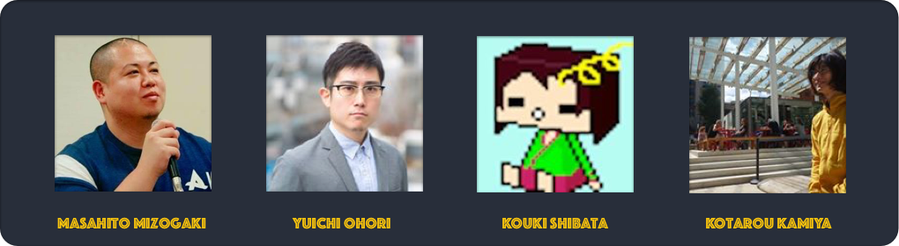
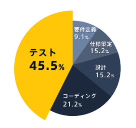

# Jirettai-Senju-Project-事業計画書

2017年 4月 5日 
代表者 溝垣 雅人 
所属名 株式会社じれったい

 -記- 

## 事業化構想の名称 「ソフトウェア品質テスト自動化ツール SENJU」

 

## 代表者及び共同製作者

|  氏名 | 所属 |
| --- | --- |
| 溝垣 雅人 | 合同会社じれったい  CEO & Programmer |
| 大堀 祐一 | 合同会社じれったい  Product Designer |
| 柴田 幸輝 | 合同会社じれったい Chief Technology Officer |  
| 神谷 小太郎| 合同会社じれったい Chierf Information Officer |

#### 溝垣 雅人 プロフィール
フリーランスのプログラマーとして様々な現場で開発を経験して2017年に起業する 
高い志と情熱を持ち，ソフトウェアの労働環境及び品質を改善するために現在も邁進している 
今後もソフトウェアによって多様な品質改善のビジネスを提案していく   

#### 大堀 祐一 プロフィール
今回のプロダクトに情熱と魂を込めてアサイン 
代表の溝垣とはリクルートキャリアにてアプリ開発チームでのチームメイト 
現在もプロダクトデザイナーとして様々な案件に関わる。 

#### 柴田 幸輝 プロフィール
早稲田大学卒、エンジニアになるために生まれてきた男、謹厳実直、外柔内剛 
テックレジデンス（エンジニア専門のシェアハウス）で共に技術知見や情報を交換と同時に 
ルームメイト、ハッカソンでの優勝経験もあり、技術力はピカイチ、CTOとしてアサインする 

#### 神谷 小太郎 プロフィール
京都大学卒、天才数学者、スーパーハッカー、進取果敢、真実一路 
テックレジデンス（エンジニア専門のシェアハウス）で共に技術知見や情報を交換と同時に 
ルームメイト、ハッカソンでの優勝経験もあり、圧倒的な情報量でCIOとしてアサインする 
  

 
 

## 事業の動機，開発背景
QAエンジニアをなくしたいと考えている 
それはソフトウェア開発においてQA業務が多くの開発機関と経営資源を奪うからである 
QAが自動化されれば開発期間が短くなり、ユーザへのソフトウェアの提供が飛躍的に短くなる 
また開発エンジニアもソフトウェアの開発に専念でき、結果的にソフトウェア開発の品質向上に繋がると考えている 

## 品質保証テストとは
ソフトウェアの品せ質保証テストは、コンピュータのプログラムから仕様にない振る舞い 
または欠陥（バグ）を見つけ出す作業のことです。 
エンジニアの作業時間の多くはこのテストの作業に当てられています。 
SENJU ではこのテストを効率化し円滑なソフトウェア開発を後押しします 

開発スケジュールの多くを占め、バグの少ない高品質な開発には不可欠 
大手企業ではエンジニアの1/3をテスト要員として割く 
QAテスト専門の会社も存在 
 

## マーケットサイズ

ソフトウェア開発市場規模（13兆円） 
　→QAテストの市場規模を算出（人員ベースでは約4人に1人がテスト要員） 
　→この市場を切り開く 

## targetについて！
 

## 小規模事業会社のエンジニアの方にアンケートを実施（n=23）
うち、フロントエンドが10人以上の回答だった3件は除外

### テストの実施状況
- 単体テスト　実施13　未実施7
- 結合テスト　実施19　未実施1

### 結合テストの方法について（複数回答可）
- コードを書いたプログラマーが確認する 13名
- 別のプログラマーが確認する　6名
- ディレクター　5名
- テスト会社に依頼 0名　　
- プロジェクトマネージャー 3名　　
- jenkins 1名　　
- QA、テスト専用メンバー　4名

#### *コードを書いたプログラマー自身でテストする状況は不健全*　  *専門の人員はおらず、テストの質が人に大きく依存してしまう*

## QAテストの流れ

①ソフトウェア開発 
↓↑ 
②単体テスト 
↓ 
③テスト設計 
↓ 
④結合テスト 
↓ 
⑤バグ報告 
↓ 
⑥タスク化　→① 

＝＝＝

## SENJUの提供する解決策

QAテストの流れの中の③、④をほぼ自動化し、⑤⑥バグ（仕様との差）報告をスムーズにする

## HOW

特許出願中の差分抽出機能 
新旧バージョンの画面をサーバー上に保存し、その差分を自動で抽出 
確認をToDOリスト化することで高速でのバグ報告が可能 
例：　5人日→1人日　80％削減！(要検証) 

GoogleAnalyticsのようにいれる 

## デモ

 
### 新旧の画面差分をハイライト。問題のある差分はgithubへタスク登録 

 
### ストーリーの中に複数のシナリオ 

 
### チーム内でのテスト状況を確認

## 競合サービス

### Magic Pods

|  | |
| --- | --- |
| 仕組み | seleniumIDEとAppuimをベースにしたテスト実行ツール|
| 対応プラットフォーム | Andoroid iOS |
| 導入コスト　 | ipaファイルを書き出し、テストする全ての画面のスクリーンキャプチャーを作り それらをMagic PodsにインポートMagic Podsにタップする外面を選択して自然言語で実行させる。|  

### Appuim

|  | |
| --- | --- |
| 仕組み | seleniumIDEをベースにしたテスト実行ツール|
| 対応プラットフォーム | Andoroid iOS |
| 導入コスト　 | AppumuをインストールしてエンジニアがRubyやnode.jsなどのプログラミング言語で実行させる|  

## 我々のサービス

### SENJU
|  | |
| --- | --- |
| 仕組み | Xcode UITESTをベースにしたテスト自動化ツール|
| 対応プラットフォーム | iOS |
| 導入コスト　 | XcodeProjectにSDKをインポートしてXcode UITestを起動 シュミレーターを起動させて録画開始 テストしたい順に触る録画停止を押し行くとSwiftで実行コードが生成される Runして実行|  

## 隠れたマーケット
・クラウドソーシングのような小規模開発の現場 
・スピード重視で進むスタートアップ 
　→テストをしたくてもできていいなかった市場も存在 
・クラウドソーシングの市場規模 

### 料金
導入無料 
同プロジェクトにユーザー2名以上登録する際に課金。 
5000円/人月のサブスクリプション 

例：5名で1年間継続利用した場合 
（5-1）×5000×12=240,000円 

## 今後のスケジュール
|   |  |
| --- | --- |
| 初年度| α版リリース　無料開放でブラッシュアップ  β版リリース　有料版スタート  有料ユーザー獲得目標　100人（登録者数は500人見込み）|
| 2年目| 多機能化、高速化を進める  英語版リリース  有料ユーザー獲得目標　1000人（登録者数は5000人見込み) 法人向けに営業加速 |
| 3年目| バグの自動抽出機能リリース  有料ユーザー獲得目標　10000人（登録者数は50000人見込み）　  課金者10000人獲得の際の年間売上：6億円 |
| 4年目| 有料ユーザー獲得目標　50000人（登録者数は250000人見込み） 課金者30000人獲得の際の年間売上：30億円 |
| 5年目| 有料ユーザー獲得目標　100,000人（登録者数は500,000人見込み） 課金者100,000人獲得の際の年間売上：60億円 |

以        上
